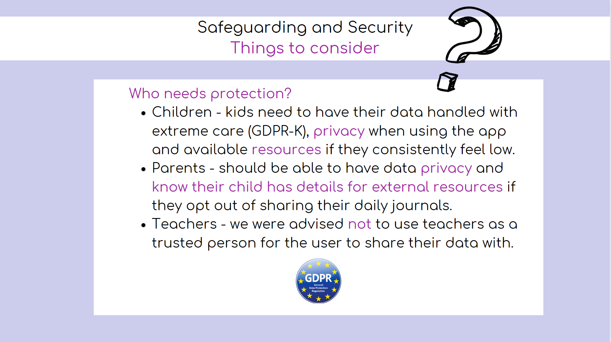
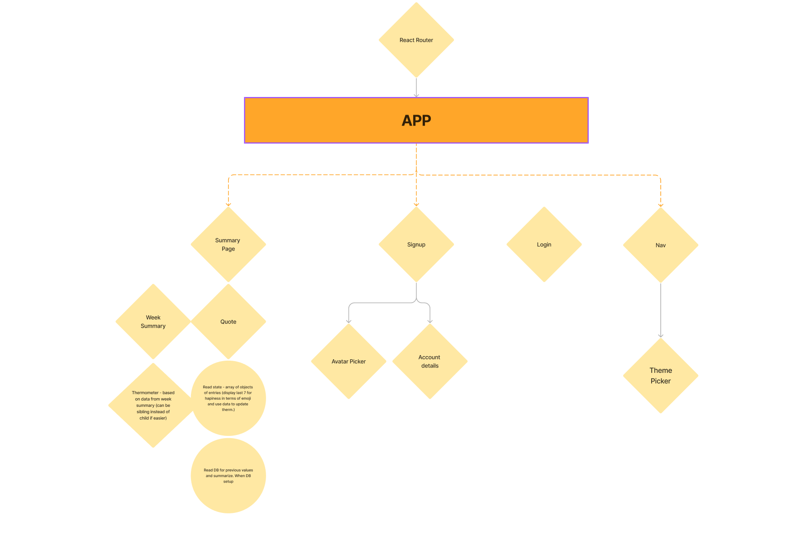
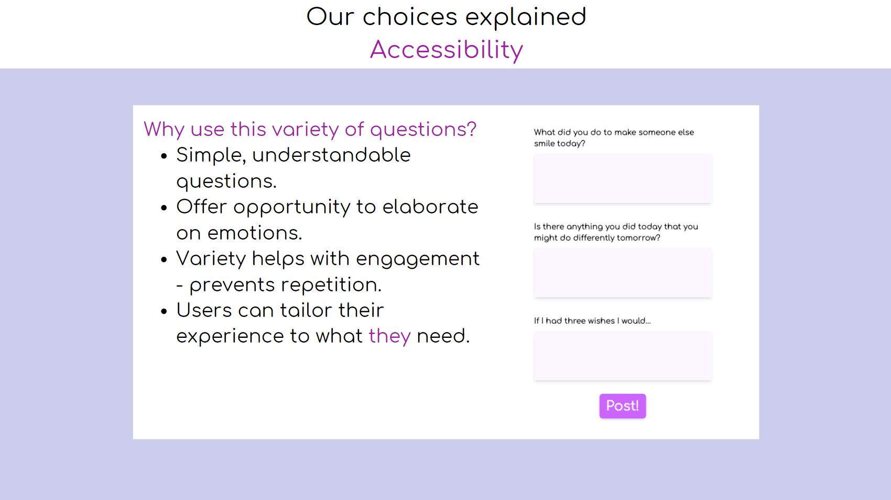
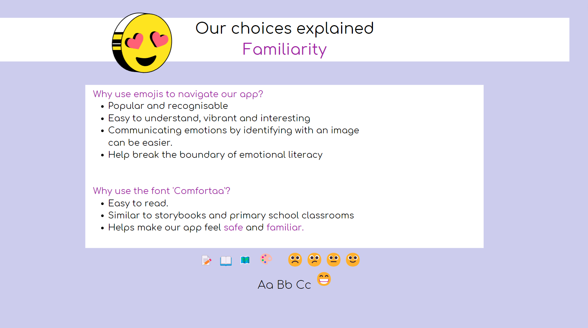
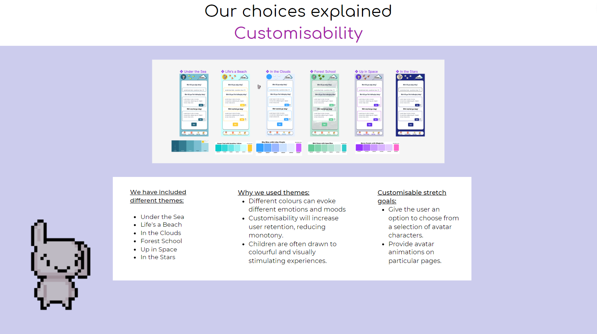
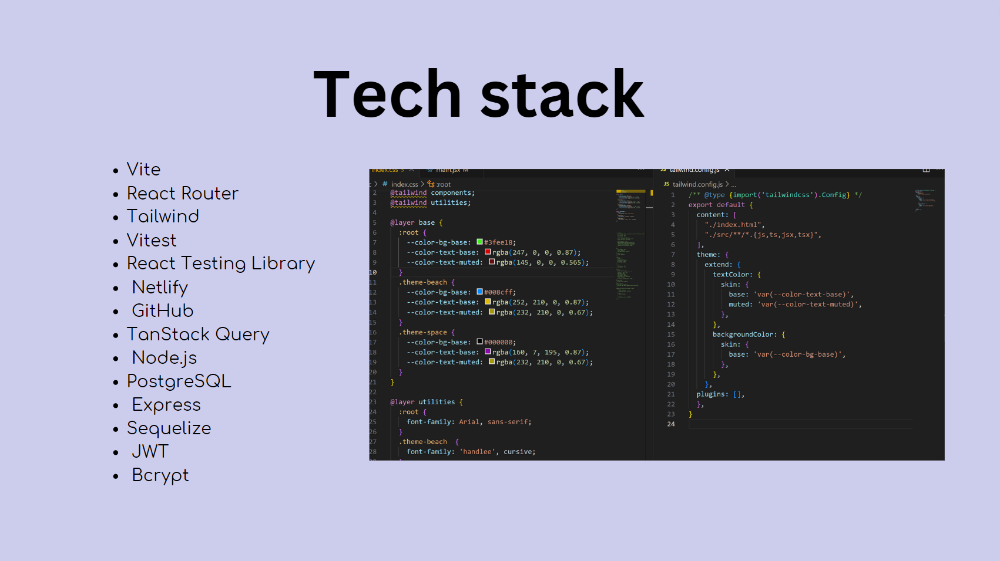
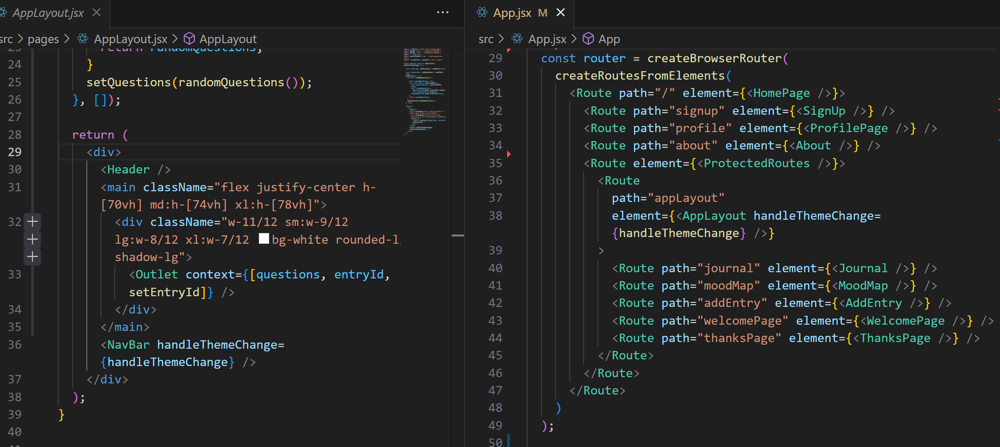

[Link to our Back End](https://github.com/dlrodev92/mighty_mini_minds_backEnd)

[Demo our app](https://wonderful-paletas-0c1299.netlify.app/)

Weicome to Mighty Mini Minds, also known as MMM... 

We collaborated as a team of 6 to design and build a Full-stack mental health application for kids aged 7 to 12 within a 5-week timeframe, in order to help them improve their ability to express their emotions and communicate their feelings with others more effectively using guided journaling. They have the option to share their journal entries with their trusted person. 

[You can view our high fideilty prototype here](https://shorturl.at/bAHW4)

[Here's a video demo of the app](https://www.youtube.com/watch?v=MhEH8YmNl_Y&ab_channel=GM)

For more insight into our user research and design process, see the highlights below or [check out our presentation](https://www.canva.com/design/DAFo4zRd770/eyrbLyuqBd3gvLHkk7FnFA/view?utm_content=DAFo4zRd770&utm_campaign=designshare&utm_medium=link&utm_source=publishsharelink)

## Problem Statement

## User Research

## Safeguarding considerations

## Low Fidelity Wireframe

## Component Tree

## Design considerations

## Tech Stack 
We used tailwind to set up our theme changer and responsive design and React Router to create a nested router to allow for pages with the Header and NavBar and for pages without them.

