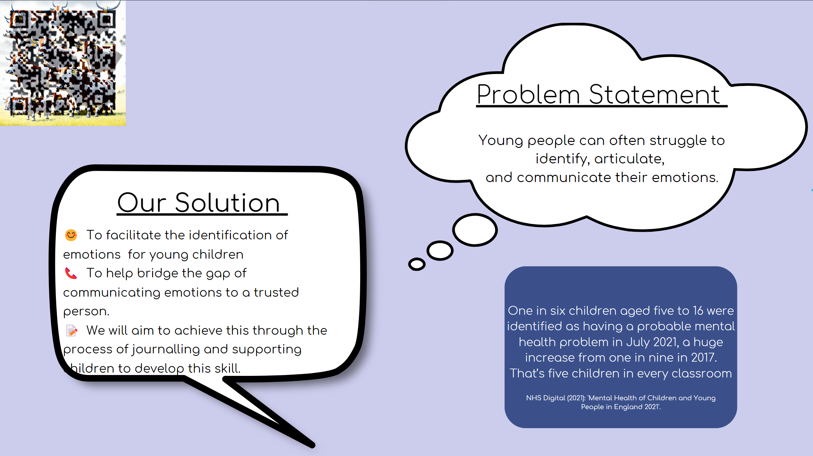
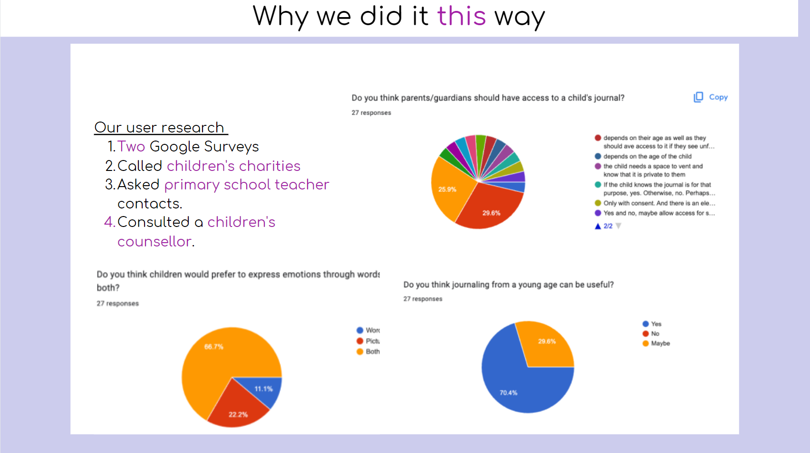
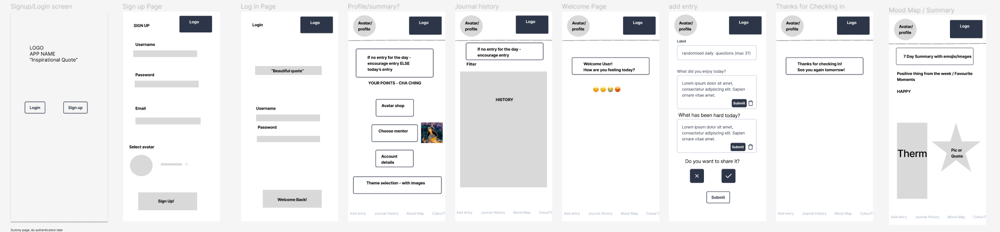

[Link to our Back End](https://github.com/dlrodev92/mighty_mini_minds_backEnd)

Weicome to Mighty Mini Minds, also known as MMM... 

We collaborated as a team of 6 to designed and buils a Full-stack mental health application for kids aged 7 to 12 with in a 5-week timeframe, in order to help them improve their ability to express their emotions and communicate their feelings with others more effectively using guided journaling. They have the option to share these entries with their trusted person. 

[You can view our high fideilty prototype here](https://shorturl.at/bAHW4)

[To try out our app click here](https://wonderful-paletas-0c1299.netlify.app/)

[Here's a video demo of the app](https://www.youtube.com/watch?v=MhEH8YmNl_Y&ab_channel=GM)

For more insight into our user research and design process, [check out our presentation](https://www.canva.com/design/DAFo4zRd770/eyrbLyuqBd3gvLHkk7FnFA/view?utm_content=DAFo4zRd770&utm_campaign=designshare&utm_medium=link&utm_source=publishsharelink)

## Problem statement

## User Research

## Low Fidelity wireframe

